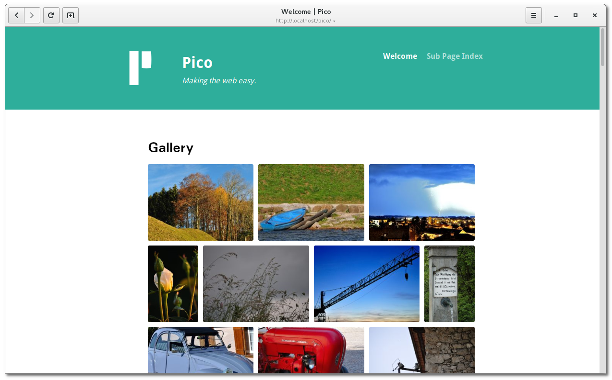

# PicoFotofolder

A masonry like gallery for [Pico CMS](http://picocms.org) including a fullscreen and lazyload capabilities. It will display all images within a folder as a gallery. It is based on the two small "vanilla" JavaScripts [baguetteBox](https://github.com/feimosi/baguetteBox.js) and [Lazyload](https://github.com/verlok/lazyload).

## Screenshot

## Installation

Copy the files from Github https://github.com/maloja/pico-fotofolder into your Pico CMS plugins folder `plugins/PicoFotofolder`.

or clone directly from Github in `plugins/PicoFotofolder`

	cd plugins
	git clone https://github.com/maloja/pico-fotofolder

or, if you installed Pico CMS with composer

	composer require maloja/pico-fotofolder

## Usage

Add the following expression in your Markdown file:

	(% fotofolder (/path/to/your/images [sort] [order]) %)

Optional arguments:
- `[sort]` Can be 'date or 'name'. This will sort the images according date, which means the exif image date not the file date, or according the filename. Default is 'name'.

- `[order]` Can be 'asc' or 'dsc'. Ascending or descending sort order. Default is 'dsc'

### Caching

In order to increase page loading speed for PicoFotofolder, an additional subfolder `/thumbnails` for thumbnails is automatically created in your image folder. Therefore, make sure that write rights are granted for your image folder. A hidden file ".fotofolder.dat" is also created. This file stores meta information of your images. The subfolder `/thumbnails` as well as the file" .fotofolder.dat "are created automatically and can be deleted at any time if incorrect information is displayed in the gallery.

### Requirements

Make sure the GD Library pgp-gd library is installed on your webserver.